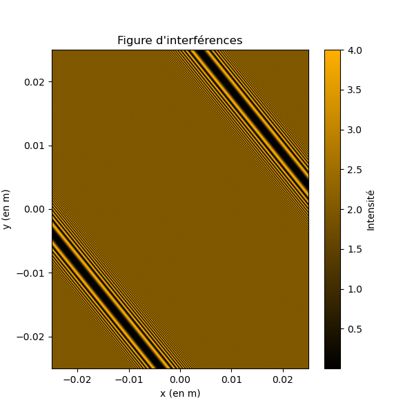
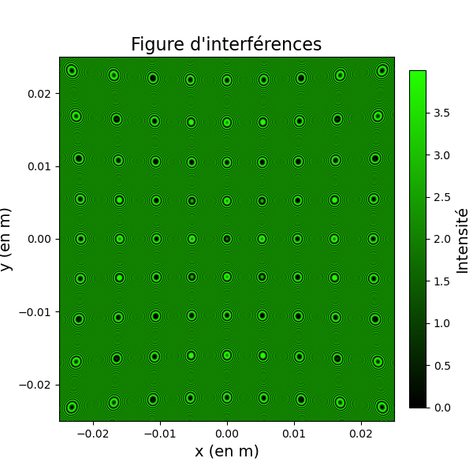

# Simulation of Interference in a Deformed Air Wedge

This project simulates and visualizes the interference pattern obtained in a Michelson-type setup, where one of the mirrors has defects (deformations). The code calculates the light intensity resulting from the superposition of two waves, taking into account the path difference induced by the mirror deformation.

## Principle

-**Setup**: A Michelson interferometer with a monochromatic light source illuminating an air wedge. One mirror is perfect, while the other has defects (step, Gaussian, sinusoidal).

-**Computation**: For each point on the screen, the code computes the optical path difference caused by the mirror deformation, then the resulting intensity due to interference.

-**Display**: The interference pattern is displayed as a colormap, with the maximum color corresponding to the selected wavelength.

## Usage

1. Run lamedair.py to generate and display the interference pattern.

2. You can modify the shape of the deformed mirror by changing the function used (Miroir_echelon, Miroir_gauss, Miroir_sin).

## Example Output

   

## Dependencies

-Python 3

-numpy

-matplotlib

## Author

BATAILLE Ewan
